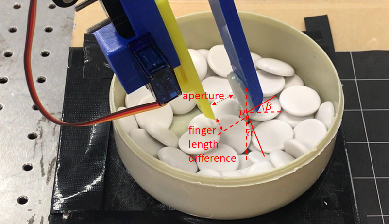
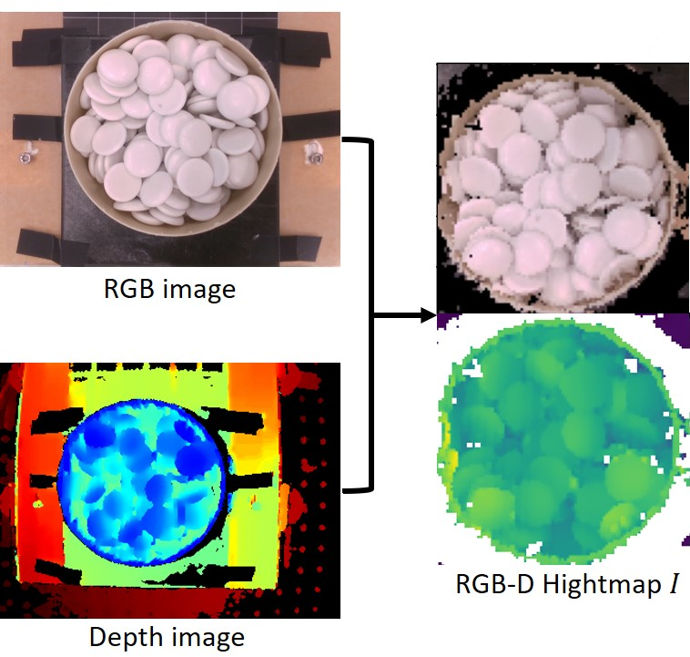
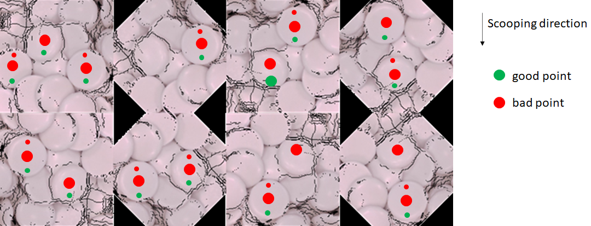
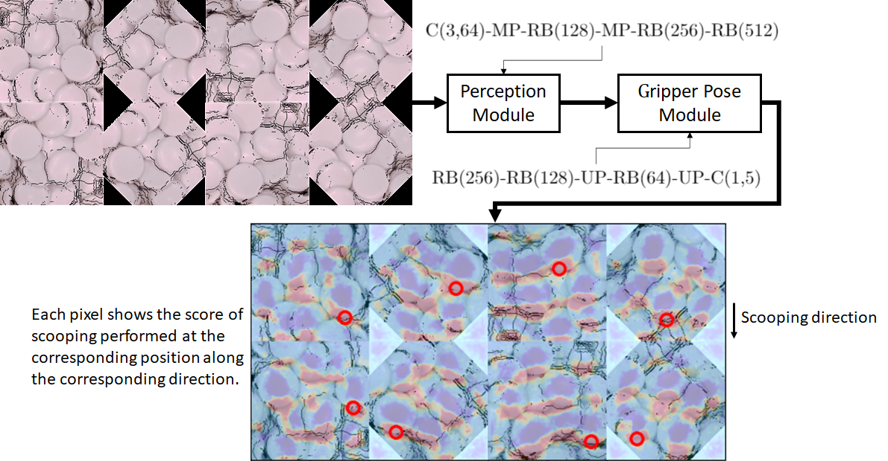

# learning
This project is to use a data-driven learning-based approach to improve the performance of the scooping technique. I designed a neural network to predict a set of parameters given the RGB-D image of the bin scenario. There are in total 5 parameters of scooping: the finger contact position p, the angle between the finger direction and the vertical direction (i.e., the pitch angle) alpha, the horizontal orientation of the gripper rotated around the vertical direction (i.e., the yaw angle) beta, the gripper aperture, and the finger length differecne, as shown in the following figure.

 

So far, I considered two parameters: the finger contact position p and the yaw angle beta. Other parameters are set as a fixed value. The whole data collecting process is as follows.

1. We use a Realsense SR300 camera to get the RGB image and the depth image. Then, we combine the RGB image and the depth image to make the RGB-D heightmap. A heightmap is an RGB-D image obtained from a 3D point cloud, describing the 3D information of the bin scenario. Each pixel in the heightmap is in linear relation to its horizontal position in the world frame and corresponds to a value indicating the height-from-bottom information. 

 

2. The input is a cropped image instead of the whole image. Given a cropped image, we rotated the image by 8 discrete directions (multiples of 45 degrees). Then, we annotate the "good" points and "bad" points denoting the "good" fingertip contact positions and the "bad" ones if the robot scoops from top to down. There are 14400 data in total. I wrote a python program to annotate the data in an autonomous manner.

 

3. The structure of the neural network is as follows. There are two modules: a perception module and a gripper pose module. The input is a cropped image rotated by 8 directions and the output is also eight images of the same dimension, where each pixel shows the score of scooping performed at the corresponding position along the corresponding direction. The red circle is the pixwl with the highest score, which is near the edge of the Go stone.

 

