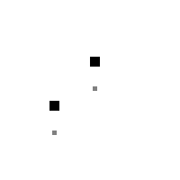

# learning

## Overview
This project is to use a data-driven learning-based approach to improve the performance of the scooping technique. I design a neural network to predict a set of parameters given the RGB-D image of the bin scenario. There are in total 5 parameters of scooping: the finger contact position p, the angle between the finger direction and the vertical direction (i.e., the pitch angle) alpha, the horizontal orientation of the gripper rotated around the vertical direction (i.e., the yaw angle) beta, the gripper aperture, and the finger length differecne. So far, I considered two parameters: the finger contact position p and the yaw angle beta. Other parameters are set as a fixed value.

## Dataset
### 1. For pre-training the network
This dataset includes a) RGB heightmap images showing the real scene of objects, b) 2-D arrays for ground truth labels The groud truth label is of the same size as the RGB heightmap, and obtained following our model-based scooping method. Each point in the label is associated with a class that represents for a background or successful/failed dig-grasp. Here shows an example:
<p align = "center">
 
 
</p>

Other data can be found via:
- [**Pre-train dataset for Go stone only**](https://drive.google.com/file/d/1qnOIFxh_5_OnTRBZUbzfDs9sMq53qkvo/view?usp=sharing)

### 2. For training the network in real
Given the pre-trained network, we collect the data by the robot performs trial and errer in real experiments. The ground truth label is obtained by a successful/failed dig-grasp in the real experiment.
Some data can be found in
- [**Training dataset from real**](https://drive.google.com/file/d/1Nmoh4N131Zmme9zlvJsgGLI3hMlcUiGU/view?usp=sharing)

## Software
### 1. Make heightmap
We use a Realsense SR300 camera to get the RGB image and the depth image. Then, we combine the RGB image and the depth image to make the RGB-D heightmap. A heightmap is an RGB-D image obtained from a 3D point cloud, describing the 3D information of the bin scenario. Each pixel in the heightmap is in linear relation to its horizontal position in the world frame and corresponds to a value indicating the height-from-bottom information. 
```
python utils/heightmap.py
```
- [**RGB-D Heightmap**](https://drive.google.com/file/d/1e2mthzXt8YYgJAtQHj9AOsfDxgdWG1B9/view?usp=sharing)

### 2. Make pre-train dataset
-Input: RGB heightmap and depth heightmap
-Output: The dataset for the pre-train model
```
python collecting_data_annotating_20210503.py
```
### 3. Collect data in real experiments
```
python data_collection_20210419.py
```
### 4. Train the network
-Input: Dataset that includes heightmap images and ground truth label
-Output: Model weights
```
training_network.ipynb
```

## Experiment results
### Tested with homogeneous cluster (Go stones)
See the video [**video**](https://drive.google.com/file/d/1G2FsejujWb6jwdD0h7qPaAmYiRuIUOz8/view?usp=sharing)
Number of training data: 11016        Success rate: 67.5%
